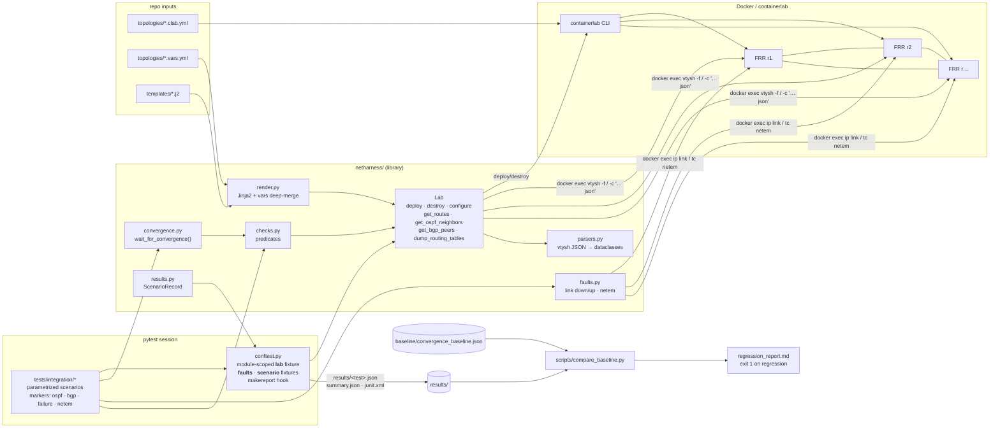

# net-harness

Automated network test harness. It spins up [containerlab](https://containerlab.dev)
topologies of FRR routers, renders and pushes OSPF/BGP configs, injects link faults
(including netem gray failures), and asserts routing-table convergence with measured
timings. pytest drives everything. Each scenario writes a structured JSON log, and a
baseline comparison flags convergence-time regressions on every CI run.

| Component | Version |
|---|---|
| Python | ≥ 3.11 (CI: 3.12, runner image: 3.14) |
| containerlab | 0.79.0 |
| Router image | `quay.io/frrouting/frr:10.5.5` (pinned) |
| Test runner | pytest ≥ 8 |

## Architecture



**Lifecycle of one test module:** `lab` fixture → `containerlab deploy` → wait until
every node's `vtysh` answers → render `frr.conf.j2` per node → `vtysh -f` push → measure
**initial convergence** (full loopback reachability) → wait for **steady state**
(tables unchanged across polls) → run scenarios → `containerlab destroy --cleanup`.

**Lifecycle of one failure scenario:** wait for the primary path → cut the link (both
veth ends, inside each container's netns) → `wait_for_convergence(start=t_cut)` until the
route moves to the backup interface → record the time → (restore test: bring the link up,
measure the return to primary) → the `faults` fixture restores everything and waits for
steady state → the `scenario` fixture takes the "after" snapshot → the hook writes JSON.

## Topologies

**`ospf_triangle`**: 3 routers, single area 0, point-to-point links, cost 10.

```
            r1 (10.0.0.1)
      eth1 /          \ eth2
   10.1.12.0/30    10.1.13.0/30
      eth1 /            \ eth1
   r2 (10.0.0.2) ---- r3 (10.0.0.3)
            eth2  10.1.23.0/30  eth2
```

**`bgp_ring`**: 4 routers, with iBGP inside AS65001 (next-hop-self) and eBGP everywhere
else. There is no IGP. Each router originates its loopback and `192.168.N.0/24`.

```
        AS65001 (iBGP)
     r1 ------------------- r2
     | eBGP                 | eBGP
     r3 ------------------- r4
  AS65002      eBGP      AS65003
```

**`ospf_triangle_bfd`, `bgp_ring_bfd`**: the same wiring with BFD (200 ms × 3, about
600 ms to detect a failure) on every OSPF interface and BGP session. Their vars files hold
only the difference: `extends: <base>.vars.yml` plus a `defaults.bfd` profile.

## Setup

### Linux host (native containerlab, same as CI)

```bash
# prerequisites: Docker, Python ≥ 3.11, make
bash -c "$(curl -sL https://get.containerlab.dev)" -- -v 0.79.0
make setup          # creates .venv, installs netharness + dev tools
make test           # FULL suite + regression check   <-- the one command
```

If containerlab needs root on your host, use `make test CLAB_SUDO=1`. The harness then
runs `sudo -E containerlab …` and uses plain `docker exec` for everything else.

### Windows / macOS (Docker Desktop)

containerlab can't run natively here. `scripts/run_in_docker.sh` builds a small runner
image (`docker/runner.Dockerfile` = official `ghcr.io/srl-labs/clab:0.79.0` + Python + make)
and runs `make test` inside it, with `--privileged --pid host --network host` and the
Docker socket mounted. From Git Bash (Windows) or a macOS terminal:

```bash
bash scripts/run_in_docker.sh                      # full suite (== make test)
bash scripts/run_in_docker.sh make lint            # any make target
PYTEST_ARGS="-m 'bgp and failure'" bash scripts/run_in_docker.sh
```

The project directory is mounted at the *same path* inside the runner as on the Docker
Desktop VM (`/run/desktop/mnt/host/<drive>/…` on Windows). containerlab passes bind-mount
paths such as `configs/daemons` straight to the Docker daemon, so the two paths must match.

### Make targets

| target | what it does |
|---|---|
| `make setup` | venv + `pip install -e .[dev]` |
| `make test` | full suite (unit + integration) → `results/`, then baseline comparison |
| `make test-unit` | pure-Python tests, no Docker needed (~2 s) |
| `make test-integration` | containerlab scenarios only |
| `make lint` | `ruff check`, `ruff format --check`, `mypy --strict` |
| `make clean` | destroy leftover labs, remove `results/` and caches |
| `make baseline-check` / `baseline-update` | compare against / overwrite the stored baseline |
| `make docker-test` | `scripts/run_in_docker.sh` |

### Useful pytest selections

```bash
.venv/bin/pytest -m ospf                       # OSPF only
.venv/bin/pytest -m "failure and not netem"
.venv/bin/pytest -k "bgp-r1" --keep-lab        # leave the lab running to poke at it
.venv/bin/python -m netharness render bgp_ring r1   # print a rendered config
.venv/bin/python -m netharness deploy ospf_triangle # manual lab (destroy likewise)
```

## Scenarios

| module | markers | what it asserts |
|---|---|---|
| `test_ospf.py` | ospf | initial convergence time; every adjacency `Full` on the right interface; every loopback learned via OSPF over the direct link with metric 10; ECMP (2 next hops) to the remote transit /30 |
| `test_bgp.py` | bgp | every iBGP/eBGP session `Established`, with session type matching the ASNs; each node originates its networks and advertises them to every peer; 12 (node, prefix) best-path checks covering AS path and egress interface; AS-path loop prevention |
| `test_failover.py` | failure + ospf/bgp | for 4 cases across both topologies: the link cut moves the route to the backup interface within an SLA (failover time recorded); the link restore returns the route to the primary path (restore time recorded) |
| `test_netem.py` | ospf, netem, failure | 50/150 ms delay leaves adjacency and path untouched past the dead interval; silent 100% loss (carrier stays up) is detected only by the OSPF dead interval, so failover must take ≈ dead interval |
| `test_bfd.py` | bfd, ospf/bgp, netem, failure | BFD sessions `up` on every link with the configured interval and multiplier; silent 100% loss detected by **BFD in ≤ 2 s** (OSPF and BGP) vs. the **BGP hold timer (5–15 s)** without it (the OSPF no-BFD reference is in `test_netem.py`) |

### Per-scenario JSON log (`results/<module>__<test>[<id>].json`)

```jsonc
{
  "test_id": "tests/integration/test_failover.py::test_link_failure_reconverges[ospf-r1-to-r2-cut-r1r2]",
  "markers": ["failure", "integration", "ospf"],
  "params": {"lab": "ospf_triangle", "case": {"observer": "r1", "prefix": "10.0.0.2/32", "...": "..."}},
  "topology": "ospf-tri",
  "started_at": "2026-10-01T17:39:42.717+00:00", "finished_at": "…", "duration_s": 5.89,
  "outcome": "passed",                       // passed | failed | error | skipped
  "convergence_s": {"failover": 0.1159},
  "routes": {                                // label -> node -> prefix -> selected route
    "before":         {"r1": {"10.0.0.2/32": {"protocol": "ospf", "metric": 10, "nexthops": [{"ip": "10.1.12.2", "interface": "eth1"}]}}},
    "during_failure": {"r1": {"10.0.0.2/32": {"protocol": "ospf", "metric": 20, "nexthops": [{"ip": "10.1.13.2", "interface": "eth2"}]}}},
    "after":          {"…": "…"}
  },
  "events": [{"at": "…", "t_s": 1.07, "msg": "link_down", "link": "r1:eth1 <-> r2:eth1"}, "…"],
  "error": null,
  "schema_version": 1
}
```

`results/summary.json` lists the outcome and timings of every scenario in the run, and
`results/junit.xml` is the standard JUnit report. On a timeout, the failure message
includes a full diagnostic dump: `show ip route`, OSPF neighbors and BGP summary for
every node.

### Regression detection

`scripts/compare_baseline.py` collects every `convergence_s` value from **passed**
scenarios and compares it with `baseline/convergence_baseline.json`. A metric counts as a
regression only when it is slower by more than **both** +100% **and** +1.0 s. The
absolute floor keeps sub-second noise (0.1 s → 0.25 s) from being flagged. The script
writes `results/regression_report.md` and exits 1 on any regression, which fails
`make test` and CI. To refresh the baseline after an intentional change:
`make baseline-update`, then commit the file.

### CI

`.github/workflows/ci.yml` runs on every push and PR:

1. **lint-unit**: `make lint` + `make test-unit`.
2. **integration**: installs containerlab 0.79.0, checks for `sch_netem`, pre-pulls
   FRR, runs `make test` with `CLAB_SUDO=1` and `NETHARNESS_REQUIRE_LAB=1` (a missing
   containerlab is a failure, not a silent skip), posts the regression report to the job
   summary, and uploads `results/` as the `scenario-results-<sha>` artifact.

## Adding a new scenario

1. **New topology (optional).** Add `topologies/<name>.clab.yml` (kind `linux`, the pinned
   image, plus the two `configs/` binds; copy an existing file) and
   `topologies/<name>.vars.yml` with per-node `router_id`, `loopback`, `interfaces`
   (`address`, `peer`) and `ospf:` / `bgp:` / `bfd:` blocks. For a variant of an existing
   topology, start the vars file with `extends: <base>.vars.yml` and state only the delta. `tests/unit/test_topologies.py`
   checks that the image pin, the link endpoints and the subnets are consistent.
2. **New config feature (optional).** Extend a partial in `templates/` and add a unit test in
   `tests/unit/test_render.py`. Unknown variables fail loudly (`StrictUndefined`).
3. **New failover case.** Append a `FailoverCase` to `FAILOVER_CASES` in
   `tests/integration/scenarios.py`. It is automatically parametrized into both the failure
   and the restore test, gets the right protocol marker, and shares the deployed lab with
   the other cases of the same topology.
4. **New kind of test.** In a module with `TOPOLOGY = "<name>"`, or parametrize `lab`
   indirectly, request `lab`, `scenario` and, for fault tests, `faults`:

   ```python
   @pytest.mark.failure
   def test_my_case(lab, faults, scenario):
       t = faults.link_down(lab.link_between("r1", "r2"))
       secs = wait_for_convergence(route_via(lab, "r1", "10.0.0.2/32", "eth2"), lab=lab, start=t)
       scenario.record_convergence("failover", secs)  # -> JSON log + baseline comparison
   ```

   Snapshots before and after, the JSON log, and fault cleanup are handled by the fixtures.
5. Run it, then `make baseline-update` to start tracking its timings.

## Test results

Last full local run: 2026-10-01, Windows 11 + Docker Desktop 29.5.3 (WSL2 kernel 6.18),
via `scripts/run_in_docker.sh`. The suite was run twice back to back: run A produced the
baseline, and run B was compared against it.

| suite | result |
|---|---|
| `make lint` (ruff + ruff format + mypy --strict) | ✅ clean |
| unit (`-m unit`) | ✅ 30 passed (~2 s) |
| integration (`-m integration`) | ✅ 47 passed (~5 min, 4 lab deployments) |
| **total `make test`** | ✅ **77 passed, 0 failed, 0 skipped**, both runs |
| baseline comparison (run B vs A) | ✅ 0 regressions across 16 metrics, all within ±0.1 s |

Measured convergence (run B):

| scenario | failover | restore |
|---|---:|---:|
| OSPF r1→r2 loopback, cut r1–r2 | 0.10 s | 1.12 s |
| OSPF r3→r1 loopback, cut r1–r3 | 0.12 s | 1.16 s |
| BGP r1→192.168.3.0/24, cut r1–r3 (eBGP → iBGP detour) | 0.12 s | 1.12 s |
| BGP r4→192.168.2.0/24, cut r2–r4 | 0.10 s | 1.15 s |
| OSPF silent 100% loss (netem, dead interval 4 s) | 3.44 s | 0.78 s |
| initial convergence after config push: OSPF / BGP | 3.40 s / 4.16 s | |

Carrier-loss failover is essentially immediate (bounded by the polling resolution). Restore
is dominated by the 1 s OSPF hello and the 1 s BGP connect-retry timer. Silent loss takes
about the dead interval, which is exactly what the test asserts.

**CI (GitHub `ubuntu-24.04`, [run 36938363039](https://github.com/jsankalp715/net-harness/actions/runs/36938363039)):
52/52 integration + 39/39 unit passed, nothing skipped (netem available on the runner),
0 regressions.** Carrier-loss failover is faster on CI (≈0.03 s) than under Docker
Desktop, because `docker exec` is cheaper on native Linux.

Silent 100% loss (carrier stays up), with BFD vs. protocol timers alone (CI):

| detection | failover | |
|---|---:|---|
| OSPF dead interval (4 s) | 3.49 s | `test_netem.py` |
| **OSPF + BFD** (200 ms × 3) | **0.58 s** | ~6× faster |
| BGP hold timer (9 s) | 7.29 s | |
| **BGP + BFD** (200 ms × 3) | **0.87 s** | ~8× faster |

The BFD scenarios have run only in CI so far: Docker Desktop on the development machine
stopped starting before they could be run locally (see the design notes).

## Design decisions & notes

- **Project location.** Built in `net-harness/` rather than at the top of `D:\code review`,
  because that directory already holds an unrelated git repo (`reviewmind/`, which
  includes a `.env`). That repo should not end up inside this project.
- **Docker Desktop support via a runner container.** On the development machine
  (Windows 11 + Docker Desktop), WSL integration was off for the Ubuntu distro and
  passwordless sudo wasn't available. I didn't change system settings; instead, containerlab
  runs inside its official image with host PID/network namespaces. CI uses native
  containerlab, with no code differences between the two paths.
- **Faults use `docker exec` into the node's netns** (`ip link set … down`, `tc qdisc …
  netem`) rather than `ip netns exec` on the host. This works identically under Docker
  Desktop, where host-side netns handles aren't reachable, and needs no root on the
  host. Both veth ends are downed to model a cable cut.
- **netem is optional.** `FaultInjector.netem_supported()` probes once by adding a 0 ms
  netem qdisc. If the kernel lacks `sch_netem`, the netem tests skip (they aren't
  marked as failing). It was available on the Docker Desktop 6.18 WSL2 kernel used for
  development. GitHub's Ubuntu runners normally ship it, and the CI job logs whether
  `modprobe sch_netem` succeeded.
- **Configs are pushed with `vtysh -f`** after deploy, not as startup configs, as the
  brief required. Output lines starting with `%` are treated as config errors. Only the
  `daemons` and `vtysh.conf` files are static bind mounts.
- **Lab-tuned protocol timers** (in the vars files, so they're visible and easy to change):
  OSPF hello 1 s / dead 4 s, point-to-point, SPF throttle 0/50/1000 ms; BGP keepalive
  3 s / hold 9 s, `advertisement-interval 0`, `timers connect 1`.
- **Two timing bugs found by the harness and fixed.** The first full run showed bimodal
  OSPF restore times (1.1 s *or* 5.0 s), and one failover took 2.4 s instead of 0.1 s,
  depending on test order. Repeated flap probes traced this to two RFC-default 5 s timers.
  The first is **MinLSInterval**: an LSA can't be re-originated within 5 s of the previous
  one. The second is the **retransmit interval**: a DD/LSU sent while the peer's end is
  still coming up is lost, and the retry waits 5 s. Setting `timers throttle lsa all 100`,
  `timers lsa min-arrival 50` and `ip ospf retransmit-interval 1` made 8/8 flap cycles
  land at 0.10–0.13 s failover and 1.12–1.17 s restore. The lab fixture and fault teardown
  now also wait for a **steady state** (tables unchanged over 3 polls), not just
  reachability, so a scenario never starts while the previous one is still converging.
- **Timing resolution.** Convergence is measured from the instant the first interface goes
  down, by polling `vtysh` every 0.25 s through `docker exec`, which takes about 0.1 s per
  call. Treat the numbers as ±0.3 s, which is why the regression check has a 1 s absolute
  floor.
- **BFD timers: 200 ms × 3.** This is deliberately conservative so that scheduler jitter
  on shared CI runners is unlikely to cause false session flaps, and it's still about 7×
  faster than the 4 s OSPF dead interval. The silent-loss test bounds each case on both
  sides: BFD cases must finish within 2 s, and the timer-based BGP case must take at least
  5 s. That proves *which* mechanism detected the failure, not just that it was detected.
- **BFD JSON schema.** The parser was first written from FRR's documented schema because
  Docker was unavailable. `test_bfd_sessions_up_with_configured_timers` stores the real
  `show bfd peers json` output in its scenario log (`events[].raw`). The first CI run
  confirmed the field names, and the unit fixture now uses that captured session. FRR
  omits `local` for single-hop sessions, and the parser handles that.
- **The baseline now comes from CI** (run 36938363039), not the dev machine. CI is where
  regressions are enforced, and local Docker was down. To refresh it, download the
  `scenario-results-<sha>` artifact (`gh run download`) and run
  `compare_baseline.py --results <dir> --update`.
- **UTF-8 everywhere.** All file reads and writes pass `encoding="utf-8"`. Windows
  defaults to cp1252, which crashed when writing the regression report's ❌ marker. Unit
  tests and lint now also run on native Windows Python.
- **Results hygiene.** The first scenario log written in a session removes the previous
  run's scenario JSONs (pass `--keep-results` to keep them), so the comparison never reads
  stale data. Unit-only runs leave `results/` untouched.
